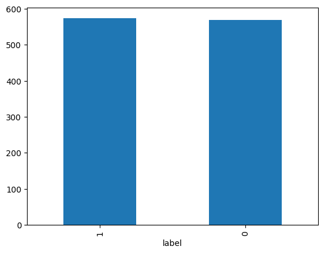

# 📩 Spam Message Classification Using NLP

## 📌 Overview
This project develops an Indonesian spam message classification model using Natural Language Processing (NLP). The workflow includes text preprocessing, TF-IDF feature extraction, Logistic Regression model training with hyperparameter tuning using GridSearchCV, and performance evaluation. WordCloud visualization is used to explore the most frequent words in spam and non-spam messages.

## 🎯 Objectives
- Classify Indonesian text messages into Spam and Non-Spam.
- Apply NLP preprocessing techniques to improve text quality.
- Extract textual features using TF-IDF.
- Train and evaluate a machine learning classification model.
- Visualize word distributions using WordCloud.

## 🔄 Workflow
1. Load Data
2. Exploratory Data Analysis (EDA)
3. Text Preprocessing
   - Lowercasing
   - Tokenization
   - Stopword Removal (Sastrawi)
   - Text Cleaning
4. Feature Extraction using TF-IDF
5. Train-Test Split
6. Logistic Regression Model
7. Hyperparameter Tuning (GridSearchCV)
8. Model Evaluation

## 🤖 Machine Learning Model
**Algorithm**
- Logistic Regression
**Feature Extraction**
- TF-IDF Vectorizer
**Hyperparameter Optimization**
- GridSearchCV

## 📷 Results
## 📊 Exploratory Data Analysis
### Label Distribution
Shows the distribution of spam and non-spam messages in the dataset.

  

---

### Spam WordCloud
The most frequent words appearing in spam messages.

  

---

### Non-Spam WordCloud
The most frequent words appearing in non-spam messages.

  

---

## 📈 Model Performance
The Logistic Regression model achieved excellent performance on the test dataset.
| Metric | Non-Spam | Spam |
|---------|---------:|-----:|
| Precision | 0.97 | 0.98 |
| Recall | 0.98 | 0.97 |
| F1-Score | 0.97 | 0.97 |

### Overall Metrics
| Metric | Score |
|---------|------:|
| Accuracy | **97%** |
| Macro Avg Precision | 0.97 |
| Macro Avg Recall | 0.97 |
| Macro Avg F1-Score | 0.97 |
| Weighted Avg Precision | 0.97 |
| Weighted Avg Recall | 0.97 |
| Weighted Avg F1-Score | 0.97 |

### Prediction Sample
| Message | Predicted Label |
|----------|-------------|
| "Sayng belikan aku pulsa di nmr ini 085212345678 nanti aq tlpn qmu balik, aq pke hp tmn" | Spam |
| "Besok kita masuk kuliah jam 07:30 di gedung A." | Non-Spam |
| """TUTUP CC & KTA ANDA, KAMI BANTU DNGN 2 SOLUSI: 1. CICIL TETAP BUNGA 2% 2. DISC PELUNASAN 30% S/D 60% CLEAR BI & LEGAL INFO : TELP/WA : SARI 085212345678""" | Spam |

## 🔮 Future Improvements
- Compare multiple machine learning algorithms (Naive Bayes, SVM, Random Forest).
- Experiment with deep learning models such as LSTM or BERT.
- Deploy the model as a web application.
- Increase the dataset size for better generalization.

## 👩‍💻 Author
Kanessa Jasmine
